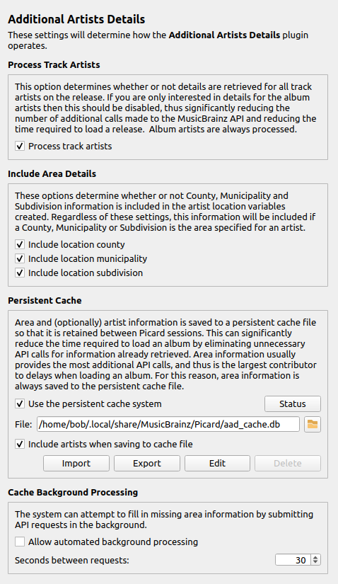
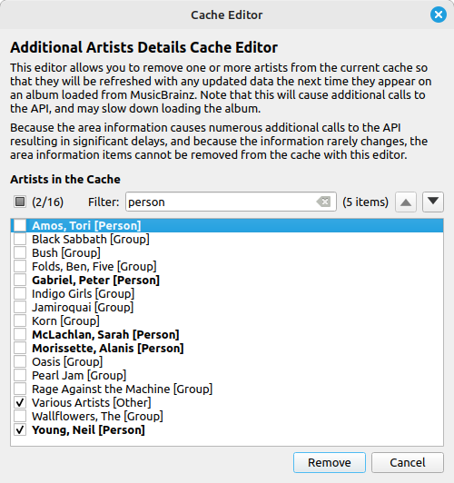
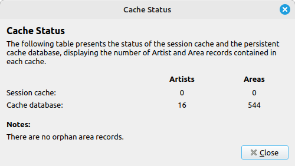

Additional Artists Details
===========================

Overview
---------

This plugin provides specialized album and track variables with artist details such as type, gender, begin and end dates, location (begin, end and current) and country code (begin, end and current) for use in tagging and naming scripts.

.. note::

   This plugin makes additional calls to the MusicBrainz website API for the information, which will slow down retrieving album information from MusicBrainz. This will be particularly noticable when there are many different album or track artists, such as on a \[Various Artists\] release. There is an option to disable track artist processing, which can significantly increase the processing speed if you are only interested in album artist details.

What it Does
----------------

This plugin reads the album and track metadata provided to Picard, extracts the list of associated artists, retrieves the detailed information from the MusicBrainz website, and exposes the information in a number of additional variables for use in Picard scripts.

The plugin maintains a cache of artist and area information retrieved from MusicBrainz to avoid making multiple API calls for the same information. This can significantly reduce the time required to load an album by eliminating unnecessary API calls for information already retrieved.

There is a persistent cache system that utilizes a sqlite file to retain the information from the cache for use in subsequent Picard sessions.

Area and (optionally) artist information is saved to the persistent cache file. Area information usually provides the most additional API calls, and thus is the largest contributor to delays when loading an album. For this reason, area information is always saved to the persistent cache file.

When artist and area information is retrieved from MusicBrainz, the persistent cache file is updated automatically with any new items, and the items are added to the session working cache.

Option Settings
----------------

The plugin adds a settings page under the "Plugins" section under "Options..." from Picard's main menu. This allows you to control how the plugin operates with respect to processing track artists and detail included in the artist location variables' content.

|

Track processing
+++++++++++++++++

This option determines whether or not details are retrieved for all track artists on the release. If you are only interested in details for the album artists then this should be disabled, thus significantly reducing the number of additional calls made to the MusicBrainz API and reducing the time required to load a release. Album artists are always processed.

Details to include
+++++++++++++++++++

These options determine whether or not County, Municipality and Subdivision information is included in the artist location variables created. Regardless of these settings, this information will be included if a County, Municipality or Subdivision is the area specified for an artist.

Persistent cache
+++++++++++++++++

There is an option to determine whether the persistent cache system is used. It is **strongly** recommended that this be enabled.

All area records, and optionally artist records, are stored to a persistent cache sqlite database file as they are retrieved from the MusicBrainz API. This is to allow the information to be used in subsequent Picard sessions without having to repeat the API calls. The path and file name of the persistent cache file is displayed, and there is a button to open the directory in your system file browser for easy access.

Area information is always stored in the persistent cache file, because area lookups produce the largest amount of API calls that impact album loading time. Artist information storage in the persistent cache file is optional, but recommended.

While area information is almost always static and does not change, artist information occasionally changes things like location, begin or end dates, or disambiguation. If artist information is retained in the persistent cache file, the variables created will not contain any updated information that has changed since the artist record was stored. There are two ways to address this. One way is to disable including the artists in the persistent cache file, and the other way is to remove one or more selected artists from the current working cache using the cache editor. Removing specific artists will trigger refreshing only those artists the next time they are encountered on an album.

.. note::

   If use of the persistent cache system is disabled, no information will be written to, or read from, the persistent cache file.

|

The cache editor displays a list of the artists currently contained in the cache. It allows you to remove one or more artists from the cache database file by selecting them from the list and clicking the :guilabel:`Remove` button. There is a check box to quickly select or deselect all artists, and an option to highlight and quickly move between artists using a filter.

Because the area information causes numerous additional calls to the API resulting in significant delays, and because the information rarely changes, the area information items cannot be removed from the cache with the cache editor.

The persistent cache action buttons include:

- :guilabel:`Import` - Import items from a user-specified cache file into the cache. This can import backup files in CSV format saved using the Export function, or JSON format files saved using the Export function from prior versions of the plugin.
- :guilabel:`Export` - Export the items from the current cache database to a user-specified file in CSV format. This can be used to generate a copy of the cache for backup purposes, for transferring to a different system, or for sharing with others.
- :guilabel:`Edit` - Open the cache editor dialog. This allows you to review, and optionally remove, the artist records from the cache so that they are refreshed the next time they are included on an album retrieved from MusicBrainz.
- :guilabel:`Delete` - Remove the cache database file from your system. This button is disabled if there is no existing cache database file, or if the option to use the persistent cache system is enabled.

.. caution::

   When the option to include artists when saving to the cache file is disabled, the artist information will **not** be written when using the :guilabel:`Export` action.

There is also a :guilabel:`Status` button which shows information about the current session cache as well as the cache database.

|

This displays the number of artist and area records currently stored in the session cache and the cache database file. It also indicates if there are any missing area parent records, and how many, and whether the missing area background processing is currently active.

Cache Background Processing
++++++++++++++++++++++++++++

Occasionally, area information is not retrieved from MusicBrainz as part of the normal album retrieval. This is typically the result of the MusicBrainz API being overloaded (usually by AI scrapers). Missing area information can result in incomplete area information in tags generated for an artist.

The plugin attempts to address this by periodically reviewing the cache database to identify any missing parent areas, and generating requests for the information from the MusicBrainz API in the background. This functionality is enabled by default (strongly recommended), however there is an option to disable it. You can also set the number of seconds to wait (from 20 to 600 seconds) between sending area requests to the API.

The background processing will be automatically terminated if there are no missing parent area records, or if there was an unrecoverable error encounted such as too many retries due to the API being unavailable. Errors causing the processing to be terminated are logged.

If the background processing has been terminated, and you wish to restart it, you can use the :menuselection:`Plugin Tools --> Start background area retrieval processing` action from the main Picard menu bar.

Variables Created
------------------

* **\_artist_\{artist_id\}_begin** - The begin date (birth date) of the artist
* **\_artist_\{artist_id\}_begin_country** - The begin two-character country code of the artist
* **\_artist_\{artist_id\}_begin_location** - The begin location of the artist
* **\_artist_\{artist_id\}_country** - The two-character country code for the artist
* **\_artist_\{artist_id\}_disambiguation** - The disambiguation information for the artist
* **\_artist_\{artist_id\}_end** - The end date (death date) of the artist
* **\_artist_\{artist_id\}_end_country** - The end two-character country code of the artist
* **\_artist_\{artist_id\}_end_location** - The end location of the artist
* **\_artist_\{artist_id\}_gender** - The gender of the artist
* **\_artist_\{artist_id\}_name** - The name of the artist
* **\_artist_\{artist_id\}_sort_name** - The sort name of the artist
* **\_artist_\{artist_id\}_type** - The type of artist (person, group, etc.)

.. note::

   A variable will only be created if the information is returned from MusicBrainz. For example, if a gender has not been specified in the MusicBrainz data then the **%\_artist_\{artist_id\}_gender%** variable will not be created.

Examples
---------

If you load the release **Wrecking Ball** (release `8c759d7a-2ade-4201-abc2-a2a7c1a6ad6c <https://musicbrainz.org/release/8c759d7a-2ade-4201-abc2-a2a7c1a6ad6c>`_) by Sarah Blackwood (artist `af7e5ea9-bd58-4346-8f78-d672e9f297f7 <https://musicbrainz.org/artist/af7e5ea9-bd58-4346-8f78-d672e9f297f7>`_), Jenni Pleau (artist `07fa21a9-c253-4ed0-b711-d63f7965b723 <https://musicbrainz.org/artist/07fa21a9-c253-4ed0-b711-d63f7965b723>`_) & Emily Bones (artist `541d331c-f041-4895-b8f2-7db9e27dc5ab <https://musicbrainz.org/artist/541d331c-f041-4895-b8f2-7db9e27dc5ab>`_), the following variables will be created:

Sarah Blackwood (primary artist):

* **\_artist_af7e5ea9_bd58_4346_8f78_d672e9f297f7_begin** = "1980-10-18"
* **\_artist_af7e5ea9_bd58_4346_8f78_d672e9f297f7_begin_country** = "CA"
* **\_artist_af7e5ea9_bd58_4346_8f78_d672e9f297f7_begin_location** = "Burlington, Ontario, Canada"
* **\_artist_af7e5ea9_bd58_4346_8f78_d672e9f297f7_country** = "CA"
* **\_artist_af7e5ea9_bd58_4346_8f78_d672e9f297f7_disambiguation** = "rockabilly, + "Somebody That I Used to Know""
* **\_artist_af7e5ea9_bd58_4346_8f78_d672e9f297f7_gender** = "Female"
* **\_artist_af7e5ea9_bd58_4346_8f78_d672e9f297f7_location** = "Canada"
* **\_artist_af7e5ea9_bd58_4346_8f78_d672e9f297f7_name** = "Sarah Blackwood"
* **\_artist_af7e5ea9_bd58_4346_8f78_d672e9f297f7_sort_name** = "Blackwood, Sarah"
* **\_artist_af7e5ea9_bd58_4346_8f78_d672e9f297f7_type** = "Person"

Jenny Pleau (additional artist)

* **\_artist_07fa21a9_c253_4ed0_b711_d63f7965b723_country** = "CA"
* **\_artist_07fa21a9_c253_4ed0_b711_d63f7965b723_gender** = "Female"
* **\_artist_07fa21a9_c253_4ed0_b711_d63f7965b723_location** = "Kitchener, Ontario, Canada"
* **\_artist_07fa21a9_c253_4ed0_b711_d63f7965b723_name** = "Jenni Pleau"
* **\_artist_07fa21a9_c253_4ed0_b711_d63f7965b723_sort_name** = "Pleau, Jenni"
* **\_artist_07fa21a9_c253_4ed0_b711_d63f7965b723_type** = "Person"

Emily Bones (additional artist)

* **\_artist_541d331c_f041_4895_b8f2_7db9e27dc5ab_gender** = "Female"
* **\_artist_541d331c_f041_4895_b8f2_7db9e27dc5ab_name** = "Emily Bones"
* **\_artist_541d331c_f041_4895_b8f2_7db9e27dc5ab_sort_name** = "Bones, Emily"
* **\_artist_541d331c_f041_4895_b8f2_7db9e27dc5ab_type** = "Person"

Note that variables will only be created for information that exists for the artist's record.

This could be used to set a **%country%** tag to the country code of the (primary) album artist with a tagging script like:

.. code-block:: taggerscript

   $set(_tmp,_artist_$getmulti(%musicbrainz_albumartistid%,0)_)
   $set(country,$if2($get(%_tmp%country),$get(%_tmp%begin_country),$get(%_tmp%end_country),xx))

Source Code
----------------

The source code for this plugin is available on `GitHub <https://github.com/rdswift/picard-plugin-additional-artists-details>`_.
