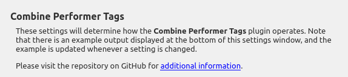
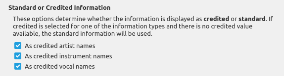
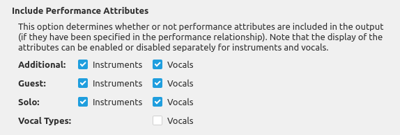
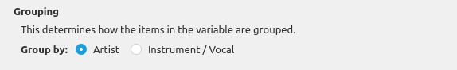
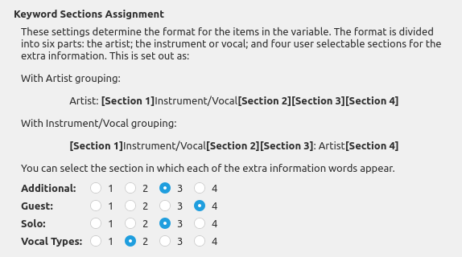
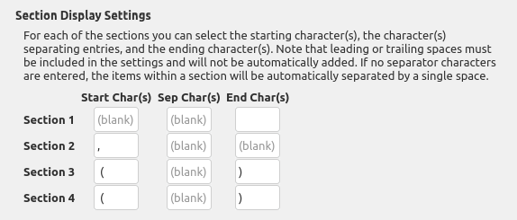
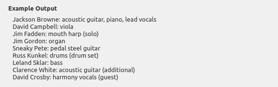

Combine Performer Tags
===========================

Overview
---------

This plugin combines all instrument and vocal performer tags into a new multi-value variable ``%_performers%`` for each track. It requires that the "**Use track relationships**" setting is enabled in **Options** -> **Metadata**. Depending on the "Grouping" setting, each item in the variable is either the performer's name followed by the instruments and vocals they performed (e.g. "*Jackson Browne: acoustic guitar, piano, lead vocals*") or the instrument or vocal name followed by the artists associated with that instrument or vocal (e.g. "*acoustic guitar: Jackson Browne, Clarence White (additional)*").

.. note::

   The plugin makes no additional calls to the MusicBrainz database, and it does not remove any of the ``%performer:*%`` tags.

What it Does
----------------

This plugin reads the track metadata provided to Picard, extracts the list of associated instrument and vocal performers, and combines the information in a multi-value variable for use in Picard scripts.

Option Settings
----------------

The plugin adds a settings page under the "Plugins" section under "Options..." from Picard's main menu. This allows you to control how the plugin operates with respect to processing track performance artists and the attribute details included in ``%_performers%`` variable.

|

.. note::

   There is an example section at the bottom of the settings page to show how the information will be displayed. This example is updated each time a setting is modified.

Standard or Credited Information
+++++++++++++++++++++++++++++++++

|
| These options determine whether the information is displayed as **credited** or **standard**. This applies to Artists, Instruments and Vocals, and the display format for each can be set separately. If credited is selected for one of the information types and there is no credited value available, the standard information will be used.

Include Performance Attributes
+++++++++++++++++++++++++++++++

|
| This option determines whether or not performance attributes are included in the output (if they have been specified in the performance relationship). The display of each of the attributes -- additional, guest, solo and vocal types -- can be enabled or disabled separately for instruments and vocals.

Grouping
+++++++++

|
| This option determines how the performance items are grouped -- either by artist or instrument/vocal.

If grouped by artist, each artist will be listed in a separate item along with all of the instruments and vocals associated with the artist. The artists will be sorted in alphabetical order by the artist's sort name, with artists having an associated instrument appearing before an artist with a vocal credit only. The instruments/vocals will be sorted in alphabetical order with all instruments appearing before any vocals.

If grouped by instrument/vocal, each instrument or vocal will be listed in a separate item along with all of the artists associated with the instrument or vocal. The instruments/vocals will be sorted in alphabetical order with all instruments appearing before any vocals. The artists will be sorted in alphabetical order by the artist's sort name.

Keyword Sections Assignment
++++++++++++++++++++++++++++

|
| These settings determine the format for the items in the variable. The format is divided into six parts: the artist; the instrument or vocal; and four user selectable sections for the extra information. This is set out as:

With Artist grouping:

   Artist: [Section 1]Instrument/Vocal[Section 2][Section 3][Section 4]

With Instrument/Vocal grouping:

   [Section 1]Instrument/Vocal[Section 2][Section 3]: Artist[Section 4]

You can select the section in which each of the extra information words appear.

Section Display Settings
+++++++++++++++++++++++++

|
| For each of the sections you can select the starting character(s), the character(s) separating entries, and the ending character(s). Note that leading or trailing spaces must be included in the settings and will not be automatically added. If no separator characters are entered, the items within a section will be automatically separated by a single space.

Example Output
++++++++++++++++

|
| The example output section at the bottom of the settings page shows how the information will be displayed in the multi-value variable. This is intended to help you fine tune your settings so that the information is displayed in the format that you prefer. The example is updated each time a setting is modified.

Examples
---------

You can use the following tagger script to include this in the tags written to the files:

.. code-block:: taggerscript

   $noop( Set as a multi-value tag. )
   $setmulti(Performers,%_performers%)

or:

.. code-block:: taggerscript

   $noop( Set as a regular text tag. )
   $set(Performers,%_performers%)

If you have included this as a combined tag, you might also want to remove the individual ``%performer:*%`` tags, which can be accomplished by the tagger script:

.. code-block:: taggerscript

   $unset(performer:*)

Source Code
----------------

The source code for this plugin is available on `GitHub <https://github.com/rdswift/picard-plugin-combine-performer-tags>`_.
