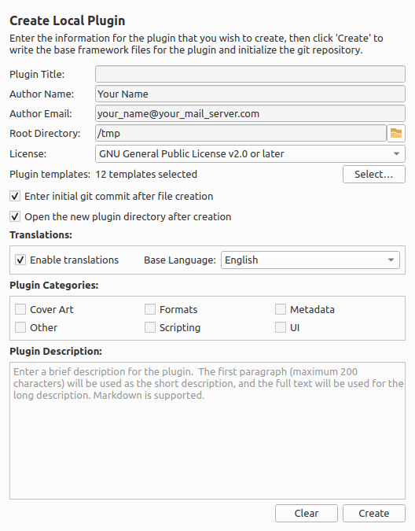
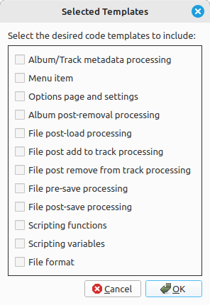

Create Local Plugin
====================

Overview
---------

This plugin assists in the creation of a local plugin by preparing the plugin framework files and git repository. Once installed and activated, it adds an option page called "Create Local Plugin" under the "Plugins" section. This is how the plugin's functionality is accessed.

What it Does
----------------

It gathers some information from the user, and then writes the basic framework files to the specified directory and initializes the git repository.

Information input includes:

- **Plugin Title**: A name for the plugin. This is used in the plugin's metadata and is how it will be displayed in Picard's plugin manager.
- **Author Name**: The name of the plugin's author. This is used in the plugin's metadata, and is the author's name used for the initial commit to the git repository.
- **Author Email**: The email address of the plugin's author. This is used in the plugin's metadata as the ``mailto`` link for reporting issues. It is also used for the initial commit to the git repository.
- **Root Directory**: The root directory under which any new plugins will be created. Each new plugin and git repository will be created in a separate directory under this root directory. The individual plugin subdirectory names will be derived automatically from the plugin's title.
- **License**: The license under which the plugin is distributed, and is used in the plugin's metadata. The license is selected from a list of common open source licenses. There is also an option for "Other" or proprietary, which will allow you to specify a custom license; however, this will have to be entered into the plugin's ``MANIFEST.toml`` file manually.
- **Plugin Templates**: A list of the code templates selected to include in the generated plugin. See the "Example Code Templates" below for more details.
- **Plugin Categories**: The categories to which the plugin belongs. This is used in the plugin's metadata, and is how the plugin will be categorized on the Picard website and in the Picard plugins registry. Multiple categories can be selected for a plugin, and the categories are not mutually exclusive. If no categories are selected, then the plugin will be uncategorized. See the "Plugin Categories" section below for more details.
- **Plugin Description**: A brief description of the plugin's functionality (2000 characters or less), and may contain markdown. This is used in the plugin's metadata, and is also added to the ``README.md`` file for the plugin. The plugin's short description is also added to the plugin's metadata, and is used in the plugin listing on the Picard website. The short description is generated automatically by taking the first paragraph of the plugin description, up to a maximum of 200 characters.
- **Multi-language Support**: This option allows you to create a plugin with multi-language support, which will add the necessary files and structure for supporting translations of the plugin's metadata and user interface. This option is recommended, because it allows the plugin to be more easily translated in the future, and also provides a framework for handling translations of any user interface elements that the plugin may have. This option does not add any additional steps to the plugin creation process, and does not require any additional information from the user other than selecting the base language for the plugin. It will provide some additional files and structure to the plugin framework that is created.
- **Create Initial Commit**: This option determines whether or not to create an initial commit to the git repository for the plugin. The default is to create an initial commit. The initial commit will be made with the generated plugin files, and the commit message will be "Initial commit". The author of the commit will be set to the name and email address provided in the plugin information. Regardless of the setting of this option, a git repository will be initialized in the target directory.
- **Open Plugin Directory**: This option determines whether or not to open the directory of the newly created plugin in your system file browser after the plugin has been created. This allows you to inspect the plugin files that have been generated, and edit the files to customize the plugin as required.

Once you have entered all of the required information and selected the desired options, you can click the :guilabel:`Create` button to create the plugin framework files and git repository in the plugin-specific directory under the specified root directory. The system first checks that the target directory exists or can be created, and that it is empty. You will then be prompted to confirm whether or not you want to proceed with creating the plugin files.

.. caution::

   It is recommended that you review the information entered and confirm that it is correct before proceeding. This is because the plugin files will be generated and the git repository will be initialized based on the information you have provided. If you need to make any changes, you can click :guilabel:`No` to return to the plugin creation form, and make any necessary changes before confirming again. All items including plugin title, author information, and description can be edited in the generated files later if necessary.

When you have confirmed, the plugin will generate the necessary files for the plugin framework, including an ``__init__.py`` file, a ``MANIFEST.toml`` file with the plugin metadata, and a ``README.md`` file with the plugin description. If multi-language support was selected, then additional files and structure will be created for handling translations. If an options page and settings template was selected, then additional user interface files will be created. A git repository with a ``.gitignore`` file will also be initialized in the target directory. If the option to create an initial commit was selected, then an initial commit will be made with the generated plugin files.

Once the plugin has been created, you can then open the plugin directory in your file browser or terminal to view the generated files and git repository. You can then customize the generated plugin files as needed to implement the desired functionality for your plugin. You can also use the initialized git repository to manage the version control for your plugin development.

Plugin Categories
++++++++++++++++++++

The available plugin categories are:

- **Cover Art**: The plugin provides cover art related processing, such as adding a new cover art source or cover art filters.
- **Formats**: The plugin provides additional or modified functionality regarding supported file formats, including support for a new file format.
- **Metadata**: The plugin modifies the metadata for an album or track, and is typically executed when the information is retrieved from MusicBrainz when an album is loaded.
- **Other**: The plugin provides functionality not covered by the other specific categories, or in addition to that provided by other categories.
- **Scripting**: The plugin provides scripting functionality, such as new script functions or new tags/variables (perhaps added via a metadata processor).
- **UI**: The plugin provides user interface modifications, such as new main or context menu actions, or other display modifications.

Example Code Templates
+++++++++++++++++++++++

The example code templates are selected from a list available by clicking the :guilabel:`Select…` button.

The available example code templates that can be included in the generated plugin file include:

- **Album/Track metadata processing**: Code template for the MusicBrainz metadata post-processor hook, including both Album and Track processing examples.
- **Menu item**: Code template for the hook used to add right-click context menu actions for albums, tracks and files in 'Unmatched Files', 'Clusters' and the 'ClusterList' (parent folder of Clusters). Actions can also be added to the main Picard menu bar.
- **Options page and settings**: Code template for adding plugin-specific user settings and an options page for managing the settings.
- **Album post-removal processing**: Code template for the hook called after a file has been removed from a track (on the right-hand pane of Picard).
- **File post-load processing**: Code template for the hook called after a file has been loaded into Picard. This could for example be used to load additional data for a file.
- **File post add to track processing**: Code template for the hook called after a file has been added to a track (on the right-hand pane of Picard).
- **File post remove from track processing**: Code template for the hook called after a file has been removed from a track (on the right-hand pane of Picard).
- **File pre-save processing**: Code template for the hook called before a file has been saved. This can for example be used to run additional pre-processing on the file.
- **File post-save processing**: Code template for the hook called after a file has been saved. This can for example be used to run additional post-processing on the file or write extra data. Note that the file's metadata is already the newly saved metadata.
- **Scripting functions**: Code template for adding new scripting functions to Picard, including examples with varying numbers of arguments. This provides the descriptions used in the scripting auto-completion and documentation.
- **Scripting variables**: Code template for adding new scripting variables to Picard, used to describe the variables in the scripting auto-completion and documentation. This is often used in conjunction with metadata processors that create new variables.
- **File format**: Code template to extend Picard with support for additional file formats. See the existing file format implementations for details on how to implement the ``_load`` and ``_save`` methods.

Option Settings
----------------

Once you have created a plugin, the following settings are remembered for the next time it is used:

- Author Name
- Author Email
- Root Directory for generated plugin directories
- License selected
- Plugin Templates selected
- Plugin Categories selected
- Whether or not to create an initial commit to the git repository
- Whether or not to create a plugin with multi-language support, and the base language for the plugin if multi-language support is enabled.
- Whether or not to open the plugin directory in your file browser automatically when a plugin has been created.

Examples
---------

There are no examples for this plugin.

Source Code
----------------

The source code for this plugin is available on `GitHub <https://github.com/rdswift/picard-plugin-create-plugin>`_.
