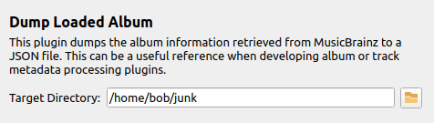

Dump Loaded Album
==================

Overview
---------

This plugin dumps the album information retrieved from MusicBrainz to a JSON file. This can be a useful reference when developing album or track metadata processing plugins.

Once installed a settings page will be added to Picard's options, which is where the plugin is configured.

What it Does
----------------

This plugin reads the release information retrieved from MusicBrainz when an album is loaded and writes it to a JSON file in the configured target directory. The album information is written using an indented, sorted format to make it easier to review. Each file contains the complete release information structure as stored in Picard, which provides a convenient reference for the available fields when developing album or track metadata processing plugins.

The JSON file is written to the target directory using a filename of the form ``Album=[album title].json``. If an album with the same title is loaded again, the existing file will be overwritten.

.. note::

   The JSON file is written immediately after the album is loaded, so any changes made to the album metadata by later processing will not be reflected in the file.

Option Settings
----------------

The plugin adds a settings page under the "Plugins" section under "Options..." from Picard's main menu. This allows you to control where the JSON file is written.

|
| The **Target Directory** setting specifies the directory where the JSON file will be written. The browse button can be used to select a directory using a file dialog. By default, the target directory is set to the user's home directory.

Examples
---------

There are no examples.

Source Code
----------------

The source code for this plugin is available on `GitHub <https://github.com/rdswift/picard-plugin-dump-loaded-album>`_.
