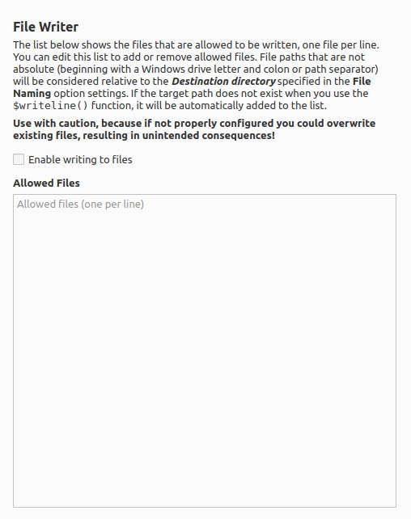

File Writer
==============

Overview
---------

This plugin adds a scripting function to allow writing text to an output file.

.. warning::

   Use with caution, because if not properly configured it could overwrite existing files, resulting in unintended consequences!

What it Does
----------------

This plugin provides a new script function ``$writeline()`` to write entries to a file.

Usage: **$writeline(file,text[,reset])**

This will write ``text`` (followed by a newline) to ``file``. The text will be appended to the file unless ``reset`` is set, in which case the file will be overwritten. If the destination ``file`` path is not specified as an absolute path to the destination file (beginning with a Windows drive letter and colon or path separator), then the path will be considered relative to the **Destination directory** specified in Picard's **File Naming** option settings. If the target path does not exist, it will be created automatically.

The plugin uses the following logic to determine whether or not to write to the file:

1. If the file does not exist, enter the file into the file list and write to the file.

2. If the file exists and is in the file list, write to the file.

3. If the file exists and does not appear in the file list, do **not** write to the file and log a warning.

.. note::

   The text will be written to the file with a character encoding of UTF-8.

Option Settings
----------------

The settings panel allows the user to provide a list of the files allowed to be written, as well as edit the list of allowed files that have been automatically entered.

|
| Each file must be entered on a separate line.

Blank lines will be automatically removed, and the lists will be sorted automatically when the settings are saved.

There is also a setting which allows the user to choose whether or not file writing is allowed. By default, file writing is diababled.

Examples
---------

Example 1
++++++++++

The following will write a text file containing a list of all the tracks on an album. The file name will be in the form "AlbumArtist - Album" and will be written in the main output directory.

.. code-block:: taggerscript

   $set(_reset,$if($and($lt(%discnumber%,2),$lt(%tracknumber%,2)),1,))
   $set(_filename,%albumartist% - %album%)
   $writeline(%_filename%,$if($gt(%totaldiscs%,1)$num(%discnumber%,2)-)$num(%tracknumber%,2) %title%,%_reset%)

Example 2
++++++++++

Similar to Example 1, the following will write a text file containing a list of all the tracks on an album.  The file name will be in the form "AlbumArtist - Album" and will be written in a separate Windows directory called ``C:\Albums``.

.. code-block:: taggerscript

   $set(_reset,$if($and($lt(%discnumber%,2),$lt(%tracknumber%,2)),1,))
   $set(_filename,%albumartist% - %album%)
   $writeline(C:\\Albums\\%_filename%,$if($gt(%totaldiscs%,1),$num(%discnumber%,2)-)$num(%tracknumber%,2) %title%,%_reset%)

Example 3
+++++++++++

The following will keep a log of all albums processed. The file will be written to the ``/var/log/PicardProcessing`` file on a Linux system. Note that this should be added to the file renaming script so that the log entry is only written when the release is saved.

.. code-block:: taggerscript

   $if($and($lt(%discnumber%,2),$lt(%tracknumber%,2)),
   $writeline(/var/log/PicardProcessing,$datetime(): %musicbrainz_albumid% : %albumartist% - %album%)
   )

Source Code
----------------

The source code for this plugin is available on `GitHub <https://github.com/rdswift/picard-plugin-file-writer>`_.
