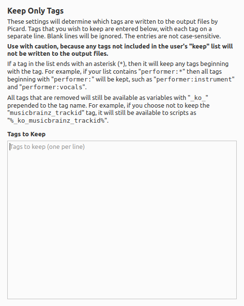

Keep Only Tags
===============

Overview
---------

This plugin provides a different approach for the user to determine which tags are written to the output files by Picard. If the user only wants to keep a small subset of the tags provided by MusicBrainz, they can specify only the tags that they want to keep rather than develop a lengthy tagger script to remove all of the tags that they don't want.

.. warning::

   Use with caution, because any tags not included in the user's "keep" list will **not** be written to the output files. As always, it is recommended that you first test your setup on a **copy** of a small subset of files to ensure that the results are as expected.

What it Does
----------------

This plugin reads the album and track metadata provided to Picard and converts any tags not found in the user's "keep" list into hidden variables by adding "``_ko_``" to the start of the tag name. The hidden variabled will not be written to the output file.

.. note::

   This plugin is configured to run before all other plugins, so that it is working with the standard set of tags provided by MusicBrainz.

Option Settings
----------------

The settings panel allows the user to provide a list of the tags to keep.

|
| Tags that you wish to keep are entered in the options settings, with each tag on a separate line. Blank lines will be ignored. The entries are not case-sensitive.

If a tag in the list ends with an asterisk (``*``), then it will keep any tags beginning with the tag. For example, if your list contains "``performer:\*``" then all tags beginning with "``performer:``" will be kept, such as "``performer:instrument``" and "``performer:vocals``".

All tags that are removed will still be available as variables with "``_ko_``" prepended to the tag name. For example, if you choose not to keep the
"``musicbrainz_trackid``" tag, it will still be available to scripts as "``%_ko_musicbrainz_trackid%``".

Examples
---------

There are no examples.

Source Code
----------------

The source code for this plugin is available on `GitHub <https://github.com/rdswift/picard-plugin-keep-only-tags>`_.
