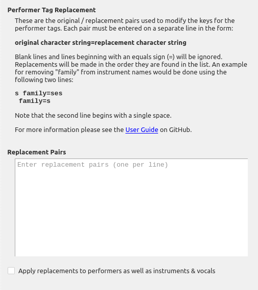

Performer Tag Replace
=======================

Overview
---------

This plugin provides the ability to replace text in performer tags. Once installed a settings page will be added to Picard's options, which is where the plugin is configured.

What it Does
----------------

This plugin reads the track metadata provided to Picard, extracts the list of associated instrument and vocal performers, and updates the performer keys based on the original/replacement pairs specified in the settings panel.

Option Settings
----------------

The settings panel allows the user to provide a list of the original/replacement pairs used to modify the keys for the performer tags.

|
| Each pair must be entered on a separate line in the form:

.. code-block:: none

   original character string=replacement character string

Blank lines and lines beginning with an equals sign (=) will be ignored. Replacements will be made in the order they are found in the list.

There is also a setting which allows the user to choose whether or not to apply the replacements to the artist values in addition to the instrument / vocal keys. By default, only the keys are processed.

Examples
---------

**Example 1:**

Suppose that you don't like instruments listed as "instrument family", but would rather have it shown as the plural of the instrument. This could be done using the following:

.. code-block:: none

   ==========================================
   = Remove "family" from instrument groups =
   ==========================================
   s family=ses
    family=s

Note that the last line begins with a single space.

This would cause the performer credit ``Performer [guitar family]: Chet Atkins`` to be changed to ``Performer [guitars]: Chet Atkins``.

Note that the ``s family=ses`` would match an instrument family where the instrument ended in "s" and add "es" rather than just an "s". For example if there was a "bass family", this would change it to "basses" rather than "basss". (As of this writing, I don't think there are any cases in the database where the instrument in an instrument family ends with an "s", so that replacement pair should never be triggered.)

**Example 2:**

Suppose that you don't like the term "additional", but would rather have it shown as "extra". This could be done using the following:

.. code-block:: none

   ==================================
   = Change "additional" to "extra" =
   ==================================
   additional=extra

This would cause the performer credit ``Performer [additional background vocals]: Jeen`` to be changed to ``Performer [extra background vocals]: Jeen``.

**Example 3:**

Suppose that you want to show the instrument as "drums" rather than "drums (drum set)", or "membranophone". This could be done using the following:

.. code-block:: none

   =====================================
   = Standardize instrument to "drums" =
   =====================================
   drums (drum set)=drums
   drum set=drums
   membranophone=drums

This would cause the performer credit ``Performer [membranophone]: Ringo Starr`` to be changed to ``Performer [drums]: Ringo Starr``.

Source Code
----------------

The source code for this plugin is available on `GitHub <https://github.com/rdswift/picard-plugin-performer-tag-replace>`_.
