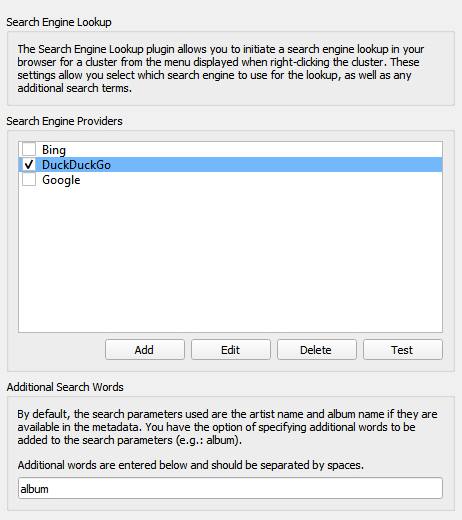

Search Engine Lookup
======================

Overview
---------

This plugin provides the ability to look up album or track items in a browser window using a search engine.

What it Does
----------------

This plugin adds a right click option on a cluster, providing the ability to lookup the cluster using a search engine in a browser window. It also provides a right click option on album and track items in the right-hand Album pane, allowing a search engine lookup for the cover art associated with the selected album or track.

When you right-click on the cluster, album or track, the lookup option is found under the "Plugins" section of the context list.

Option Settings
----------------

A settings screen is available in Picard's options settings, under the Plugins section. This allows the user to select their preferred search engine provider, and any additional words to provide with the cluster search. You can also add, edit or remove search engine providers.

|
| When adding or editing a provider, checkmarks to the right of each field indicate whether or not the information in the field is valid. The title is valid when it contains at least two non-space characters, does not begin or end with a space, and is not the same as the title of another existing provider. The URL is valid when it contains the search replacement parameter ``%search%`` and does not begin or end with, or contain any spaces. The "Save" button will be disabled until both fields are valid.

.. image:: options_edit.jpg
   :alt: options edit image
   :align: center

|

Examples
---------

There are no examples for this plugin, as it simply opens a browser window with the search results for the selected cluster, album or track.

Source Code
----------------

The source code for this plugin is available on `GitHub <https://github.com/rdswift/picard-plugin-search-engine-lookup>`_.
